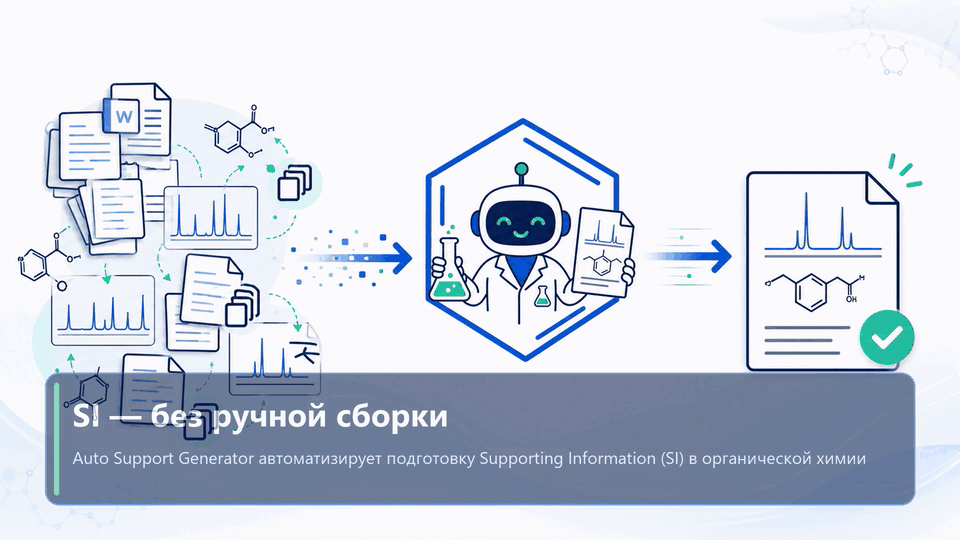

# Auto Support Generator

## Video demo

Click the preview to open the full video with sound.

## Research status and citation

Auto Support Generator is an early research software project for automated generation of supporting information in organic chemistry.

A ChemRxiv preprint describing the method, software architecture, and example workflows is currently in preparation.

Auto Support Generator is an open-source research software project. Its source code is publicly available on GitHub.

Author: Danila Lebedev  
Copyright © 2026 Danila Lebedev

## Contact

Questions, feedback, or bug reports are welcome. Contact the author:

- Email: [lebedevdanilaaa@gmail.com](mailto:lebedevdanilaaa@gmail.com)
- Telegram: [@lebdanchem](https://t.me/lebdanchem)

## Install without Git or Python

1. Open [`installer/AutoSupportGeneratorSetup.exe`](installer/AutoSupportGeneratorSetup.exe) on GitHub.
2. Click **Download raw file** and save the installer.
3. Run `AutoSupportGeneratorSetup.exe`. If Windows SmartScreen appears, verify that the file came from this repository, then choose **More info → Run anyway**.
4. Use **Browse...** to choose the installation folder or keep the suggested folder under `%LOCALAPPDATA%`.
5. Keep shortcut creation enabled and click **Install**.
6. Launch **Auto Support Generator** from the desktop or Start Menu shortcut.

Microsoft Word, ChemDraw, and MestReNova are licensed external applications and must be installed separately.

To uninstall, open **Windows Settings → Apps → Installed apps → Auto Support Generator → Uninstall**, or use **Start Menu → Auto Support Generator → Uninstall Auto Support Generator**. Generated output and settings are preserved by default.

## Choose language

- [Русская версия](README_RU.md)
- [English version](README_EN.md)

Auto Support Generator is a Windows application that builds and checks organic-chemistry Supporting Information from Word tables, ChemDraw structures and raw NMR data.

Tested integrations: ChemDraw `22.2.0.3300` and MestReNova `14.2.0-26256`. Obtain licensed installers from the [official ChemDraw download guidance](https://support.revvitysignals.com/hc/en-us/articles/4408210538132-How-do-I-download-the-MSI-installer-for-ChemDraw) and the [official Mnova downloads page](https://mestrelab.com/download).

## License

Copyright © 2026 Danila Lebedev.

This project is licensed under the Apache License, Version 2.0.

See the [LICENSE](LICENSE) file for details.
