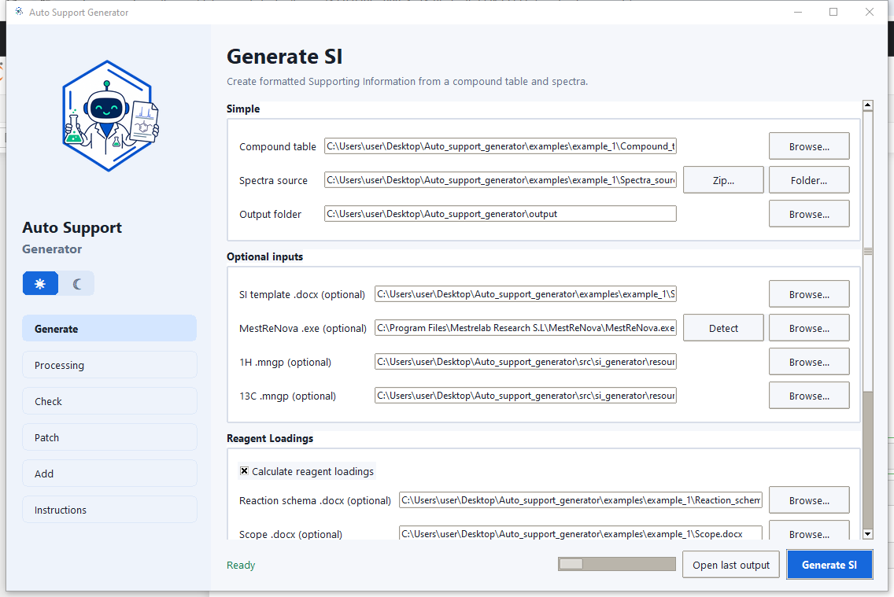

# Auto Support Generator

## Video demo

Click the preview to open the full video with sound.

Auto Support Generator is an open-source project licensed under the Apache License 2.0.

## Contact

Questions, feedback, or bug reports are welcome. Contact the author:

- Email: [lebedevdanilaaa@gmail.com](mailto:lebedevdanilaaa@gmail.com)
- Telegram: [@lebdanchem](https://t.me/lebdanchem)

## Install without Git or Python

1. Open [`installer/AutoSupportGeneratorSetup.exe`](installer/AutoSupportGeneratorSetup.exe) on GitHub.
2. Click **Download raw file** and save the installer.
3. Run `AutoSupportGeneratorSetup.exe`. If Windows SmartScreen appears, verify that the file came from this repository, then choose **More info → Run anyway**.
4. Use **Browse...** to choose the installation folder or keep the suggested folder under `%LOCALAPPDATA%`.
5. Keep shortcut creation enabled and click **Install**.
6. Launch **Auto Support Generator** from the desktop or Start Menu shortcut.

Microsoft Word, ChemDraw, and MestReNova are licensed external applications and must be installed separately.

To uninstall, open **Windows Settings → Apps → Installed apps → Auto Support Generator → Uninstall**, or use **Start Menu → Auto Support Generator → Uninstall Auto Support Generator**. Generated output and settings are preserved by default.

## Choose language

**Generate → Show scope** optionally inserts a reaction and an aligned compound overview before characterization. Each structure is labelled on one line as **compound number**, yield (for example **2a**, 80%); reagent equivalents are omitted, and editable CDXML files are saved alongside the Word output. Every numbered example includes a generated `Reference_output.docx` created with this option.

The [complete NMR all-in-one example](examples/example_4) contains 28 compounds with raw 1H/13C data for every compound and optional CIF/ORTEP data for the available subset. [Example 5](examples/example_5) adds real HSQC/HMBC processing for a five-compound benzodiazepinone series.

**Generate templates** converts an experimental method `.docx` into both a ready `All_in_one_input.docx` and the matching classic `Compound_table.docx`, `Reaction_schema.docx`, `Scope.docx` and `SI_template.docx` files. It also writes an auditable loadings table and highlights chemistry that still requires user input.

Optional **CIF source** adds X-ray structure figures, experimental descriptions and numbered crystal/refinement tables to SI. A custom crystallography template can be supplied separately or embedded in all-in-one DOCX. Raw 2D Bruker experiments (HSQC, HMBC, COSY, NOESY, TOCSY and ROESY) are processed with external 1H/13C projections and isotope-labelled `1H / ppm` and `13C / ppm` axes. **Multiple series** combines several methods with separate inputs and templates in one run. See the [crystallography guide](docs/crystallography.md) and the [complete numbered example](examples/example_4). Source changes require a new build; existing installer binaries are not automatically updated.

- [Русская версия](README_RU.md)
- [English version](README_EN.md)

Auto Support Generator is a Windows application that builds and checks organic-chemistry Supporting Information from Word tables, ChemDraw structures and raw NMR data.

Tested integrations: ChemDraw `22.2.0.3300` and MestReNova `14.2.0-26256`. Obtain licensed installers from the [official ChemDraw download guidance](https://support.revvitysignals.com/hc/en-us/articles/4408210538132-How-do-I-download-the-MSI-installer-for-ChemDraw) and the [official Mnova downloads page](https://mestrelab.com/download).

## License

Copyright © 2026 Danila Lebedev.

This project is licensed under the Apache License, Version 2.0.

See the [LICENSE](LICENSE) file for details.
