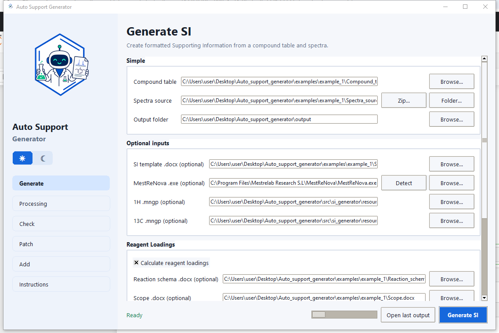

# Auto Support Generator

**English** | [Русский](README_RU.md)

## Research status and citation

Auto Support Generator is an early research software project for automated generation of supporting information in organic chemistry.

A ChemRxiv preprint describing the method, software architecture, and example workflows is currently in preparation.

Until an open-source license is added, all rights are reserved. You may view and fork this repository under GitHub's Terms of Service, but reuse, redistribution, or derivative works require permission from the author.

Author: Danila Lebedev  
Copyright © 2026 Danila Lebedev



## Purpose

Auto Support Generator builds organic-chemistry Supporting Information (SI). It transfers ChemDraw structures, physical properties and analytical data into Word, processes NMR spectra in MestReNova, calculates reaction loadings and writes validation reports.

## Features

| Page | What it does |
|---|---|
| **Generate** | Creates a new SI from a compound table and raw spectra. |
| **Processing** | Controls NMR processing, appendix type and analytical validation. |
| **Check** | Checks the integrity of a previous output: manifest, DOCX, bookmarks and artifacts. |
| **Patch** | Creates a modified SI copy without reprocessing spectra: renumber, remove, reorder or swap. |
| **Add** | Appends new compounds without rebuilding old compound blocks. |
| **Instructions** | Provides built-in help, alias tables and downloadable examples. |

The application also preserves editable ChemDraw OLE structures, obtains structure names from ChemDraw, exports PNG or clickable Mnova spectra, calculates HRMS/elemental analysis, validates NMR/HRMS/Anal, calculates reaction amounts and saves processed `.mnova` files, reports, manifests and logs.

## Requirements

| Software | Purpose | Tested version |
|---|---|---|
| Windows 10/11 | application runtime | 64-bit |
| Microsoft Word desktop | DOCX and OLE automation | Microsoft 365 / Word 2021 |
| ChemDraw | structures and names | 22.2.0.3300 |
| MestReNova | NMR processing | 14.2.0-26256 |

The packaged application does not require a separate Python installation. Open ChemDraw and MestReNova manually once before the first run. If MestReNova is not detected, select its `.exe` on Generate.

## Installation

1. Open the repository's `installer` folder.
2. Download and run `AutoSupportGeneratorSetup.exe`.
3. Install only a trusted copy obtained from this repository.
4. Launch **Auto Support Generator** from its shortcut.

For source use, install Python 3.12, run `Setup Auto SI Generator.bat`, then `Run Auto SI Generator.bat`.

## Quick start

1. Open **Instructions → Example files → Copy all examples**.
2. Start with `example_1` and replace the values in copies of its Word files.
3. On **Generate**, select `Compound_table.docx`, `Spectra_source` and an output folder.
4. Optionally select the SI template, `.mngp` profiles, Reaction schema and Scope.
5. Review spectrum settings on **Processing**.
6. Click **Generate SI**.
7. When complete, click **Open support** or **Open output folder**.

## Generate fields

### Main inputs

| GUI field | Input |
|---|---|
| **Compound table** | `Compound_table.docx`: one row per compound with number, properties, HRMS/IR/Anal and a ChemDraw OLE structure. |
| **Spectra source** | A `Spectra_source` folder or `Spectra_source.zip`, organized by compound number. |
| **Output folder** | Parent folder in which the app creates a separate run directory. |

### Optional inputs

| GUI field | Input |
|---|---|
| **SI template .docx** | `SI_template.docx` controlling text, formatting and aliases. |
| **MestReNova .exe** | `MestReNova.exe` when automatic detection fails. |
| **1H .mngp** | Custom 1H display profile; built-in classic is used when empty. |
| **13C .mngp** | Custom 13C display profile; built-in classic is used when empty. |

### Reagent Loadings

| GUI field | Input |
|---|---|
| **Reaction schema .docx** | `Reaction_schema.docx`: `Reagent_1`, `Reagent_2`, named reagents and solvents with eq, MW, density or concentration. |
| **Scope .docx** | `Scope.docx`: per-product reaction data and structures for variable reagents. |

Enable loadings only when both files are supplied. Product numbers in Compound table and Scope must match.

## Processing

| Setting | Meaning |
|---|---|
| **Check support** | Validate NMR, HRMS and elemental analysis during generation. |
| **Calculate elemental analysis** | Calculate Anal. from the formula unless the row disables it with `-`. |
| **Spectra appendix** | `png` for static images, `mnova` for clickable objects, `none` to omit the appendix. |
| **1H/13C threshold** | Minimum relative peak height. Increase it when noise or minor impurities are picked. |
| **Signal height** | Fraction of page height used by the tallest signal. |
| **1H/13C ppm range** | X-axis range in exported images. |
| **Highlight solvent peaks** | Show or suppress solvent peaks identified by MestReNova. |
| **Baseline mode** | `auto`, `off`, `Bernstein` or `Whittaker`. |
| **Apply to 1H/13C** | Select nuclei receiving baseline correction. |
| **Whittaker / polynomial parameters** | Expert parameters for the selected baseline algorithm. |

## Spectra source layout

```text
Spectra_source/
  2a/
    experiment_1H/fid
    experiment_13C/fid
  2b/
    experiment_1H/fid
    experiment_13C/fid
```

Inner experiment names may vary; acquisition metadata identifies 1H and 13C. Top-level compound numbers must match Compound table.

## Check

Select `support_information.manifest.json` from the old run's `docx` folder, optionally override a moved support DOCX, then click **Check support**. Check validates the manifest, compound order, DOCX/artifacts, bookmarks and unresolved aliases. It does not run MestReNova or recalculate analytical chemistry; that validation runs during Generate.

## Patch

Choose **Existing output folder**, select exactly one operation and click **Apply patch**. The original SI remains unchanged.

| Operation | Input | Result |
|---|---|---|
| **Renumber** | `2a=3a,2b=3b` | Changes compound numbers and linked references. |
| **Remove** | `2a,2c` | Removes compounds and their appendix pages. |
| **Reorder** | Full list such as `2c,2a,2b` | Reorders blocks; every existing number is required. |
| **Swap compounds** | `2a=3a` | Exchanges complete compound assignments while preserving visible number order. |

Patch reuses processed PNG and Mnova OLE artifacts and does not start new spectrum processing.

## Add

1. Select **Previous output folder**; manifest and support are detected automatically.
2. Select the Compound table and Spectra source containing only new compounds.
3. Choose a mode and click **Add compounds**.

| Mode | Behavior |
|---|---|
| **Same series** | Reuses the old template, Reaction schema and Processing settings. Supply a new Scope. |
| **New method** | Accepts a new SI template, Reaction schema and Scope while retaining the user's spectrum-processing settings. |

Old blocks are not rebuilt. Duplicate numbers or mismatched numbers across input files stop the operation with an error message.

## SI template aliases

Place `{Object.attribute}` aliases directly in Word. Bold/italic formatting applied to an alias is inherited by the generated value.

- Product: `{Product.name}`, `{Product.number}`, `{Product.structure}`, `{Product.mg}`, `{Product.mmol}`, `{Product.yield.percent}`, `{Product.appearance}`, `{Product.mp}`, `{Product.rf.value}`, `{Product.rf.system}`, `{Product.nmr.1h.picture}`, `{Product.nmr.13c.picture}`.
- Reagents: `{Reagent_1.name}` and `.mg`, `.g`, `.kg`, `.mmol`, `.mol`, `.mcl`, `.ml`, `.l`, `.eq`, `.number`. The same attributes work for named reagents and solvents.
- NMR: `{nmr.1h.label}`, `{nmr.1h.conditions}`, `{nmr.1h.peaks}`; equivalent `nmr.13c` fields; `{nmr.extra}`.
- HRMS: `{hrms.label}`, `{hrms.adduct}`, `{hrms.formula}`, `{hrms.calculated}`, `{hrms.found}`.
- Anal: `{anal.label}`, `{anal.formula}`, `{anal.calculated}`, `{anal.found}`.
- IR: `{ir.label}`, `{ir.method}`, `{ir.peaks}`.

The full field-by-field alias table is available under **Instructions → Template aliases**.

## Examples

Only three synchronized example sets are included in the repository and under **Instructions → Example files**:

| Folder | Contents |
|---|---|
| [`examples/example_1`](examples/example_1) | First series, compounds 2a–2d; Spectra source folder. |
| [`examples/example_2`](examples/example_2) | Series continuation, compounds 2e–2f. |
| [`examples/example_3`](examples/example_3) | New method, compounds 3a, 3b, 3c, 3d, 3i; Spectra source folder and zip. |

Every set uses GUI-matching names: `Compound_table.docx`, `Spectra_source`, `SI_template.docx`, `Reaction_schema.docx`, `Scope.docx`.

## Output

Each run creates `output/runs/YYYYMMDD_HHMMSS_name/`:

| Folder | Contents |
|---|---|
| `docx/` | final `support_information.docx` and manifest |
| `input/` | copies of inputs used for the run |
| `spectra/` | spectrum PNG files |
| `mnova/` | processed and single-spectrum `.mnova` files |
| `logs/` | diagnostic logs |
| `reports/` | processing and validation reports |

If a run fails, inspect the latest `logs/` folder first. Close an existing output DOCX before regenerating it because Word locks open files.
