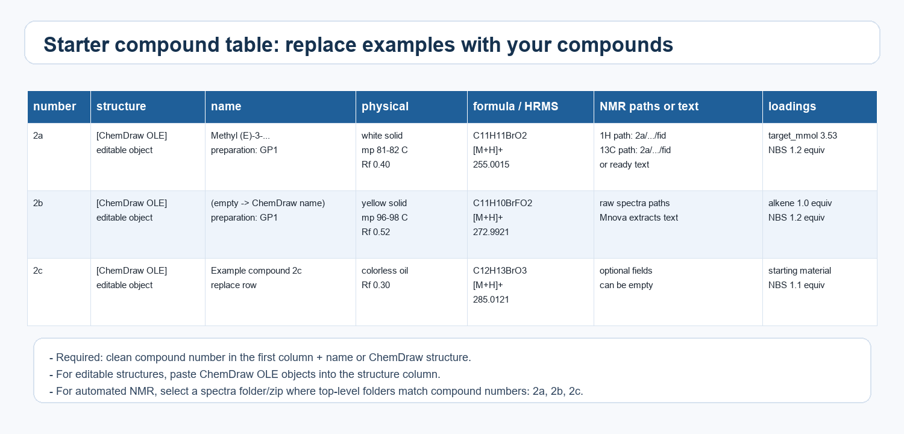
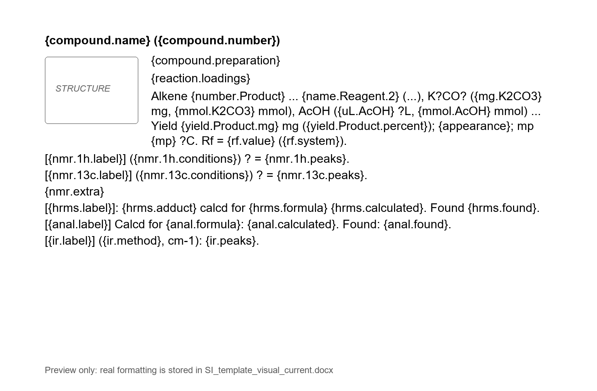

# Auto Support Generator

## Research status and citation

Auto Support Generator is an early research software project for automated generation of supporting information in organic chemistry.

A ChemRxiv preprint describing the method, software architecture, and example workflows is currently in preparation.

Until an open-source license is added, all rights are reserved. You may view and fork this repository under GitHub's Terms of Service, but reuse, redistribution, or derivative works require permission from the author.

Author: Danila Lebedev<br>
Copyright © 2026 Danila Lebedev

## Overview

Auto Support Generator is a Windows application for automated generation and checking of Supporting Information (SI) documents in organic chemistry.

The program takes a compound table, editable ChemDraw/ChemSketch structures, raw NMR spectra, HRMS/IR/elemental analysis/physical-property data and generates a formatted `support_information.docx`. It also saves exported spectrum images, processed `.mnova` files, run reports, manifests and logs.

Russian documentation is available in [README_RU.md](README_RU.md).

## Quick Start

1. Install Microsoft Word, ChemDraw and MestReNova.
2. Download and run `installer/AutoSupportGeneratorSetup.exe`.
3. Open the `Auto Support Generator` desktop shortcut.
4. Click `Load example` to load a ready-to-run example, or click `Copy starter files` to copy editable starter templates for a new project.
5. Click `Generate SI`.
6. When the run finishes, click `Open output folder` or `Open last output`.
7. Open `docx/support_information.docx`.

For a normal project, the `Generate SI` page usually needs only three fields:

| Field | What to select |
| --- | --- |
| `Compound table` | Word `.docx` table with compound data and ChemDraw structures |
| `Spectra source` | zip archive or folder with raw NMR spectra |
| `Output folder` | folder where generated files should be saved |

Most other settings can be left at their defaults.

The GUI uses a Fluent-style left sidebar. Use the navigation items on the left to switch between generation, processing settings, checking, patching and adding compounds. Use the `Dark theme` switch at the bottom of the sidebar to toggle light/dark mode; the choice is saved locally.

## Main Features

- Generates compound characterization blocks.
- Copies structures from a Word table as editable ChemDraw/ChemSketch OLE objects.
- Generates structure names from ChemDraw when the `name` field is empty.
- Processes 1H and 13C NMR spectra through MestReNova.
- Calibrates spectra by solvent.
- Extracts textual NMR descriptions from MestReNova.
- Exports spectrum images as PNG.
- Saves processed `.mnova` files.
- Inserts spectra into SI as PNG images or clickable Mnova OLE objects.
- Calculates theoretical HRMS from molecular formulas.
- Formats HRMS, NMR, IR, elemental analysis and physical properties.
- Calculates and inserts theoretical elemental analysis.
- Checks consistency of NMR/HRMS/elemental analysis against the compound formula.
- Adds warnings to reports and SI when data do not match.
- Creates a separate output folder for every run.
- Checks an already generated SI.
- Renumbers, removes or reorders compound blocks in an existing SI.
- Adds new compounds to an existing SI.

## Requirements

The full workflow is designed for Windows because it uses Microsoft Word, ChemDraw OLE and MestReNova automation.

| Program | Purpose | Tested version |
| --- | --- | --- |
| Windows | GUI and COM/OLE automation | Windows 10/11 |
| Microsoft Word desktop | `.docx` creation and OLE insertion | Microsoft 365 / Word 2019+ |
| ChemDraw / ChemOffice | structures and name generation | ChemDraw 22.2.0.3300 |
| MestReNova | NMR processing and export | MestReNova 14.2.0-26256 |

Users of the packaged application do not need to install Python separately: Python is bundled into `AutoSupportGenerator.exe`. Python is needed only for development or for building the installer from source.

Important notes:

- ChemDraw must be installed as a desktop application and must support OLE/COM editing of structures.
- MestReNova should be launched manually at least once before automation, so licensing and first-run settings are initialized.
- If MestReNova is not detected automatically, specify the path to `MestReNova.exe` in the GUI on the `Processing` page.
- Unicode paths are supported. For ChemDraw/MestReNova automation, working files may be copied temporarily into `C:\Users\Public\AutoSupportGenerator\temp` because external desktop programs do not always handle Unicode paths reliably.

## Installing the Packaged Version

The simplest installation route:

1. Open the repository: <https://github.com/danilalebedev/Auto_support_generator>
2. Open the `installer` folder.
3. Download `AutoSupportGeneratorSetup.exe`.
4. Run the downloaded file.
5. Start `Auto Support Generator` from the desktop shortcut or from the Start menu.

The installer copies the application to:

```text
%LOCALAPPDATA%\AutoSupportGenerator
```

The installed folder also contains examples, README files and auxiliary templates.

## Running from Source

This route is intended for developers or for users who downloaded the repository as a ZIP archive and want to run the program without the installer.

1. Install Python 3.12.
2. Download the project using `Code -> Download ZIP` on GitHub.
3. Extract the archive.
4. Run `Setup Auto SI Generator.bat`.
5. After dependencies are installed, run `Run Auto SI Generator.bat`.

## Main Workflow

### 1. Prepare the Compound Table

The recommended input is a Word `.docx` file containing a table. The first row contains column headers, and every following row represents one compound.

Use a clean compound number such as `2a`, `2b`, `3c`. If you need editable structures in the generated SI, paste ChemDraw or ChemSketch OLE objects into the structure column.

If a structure is inserted as a normal image, the program cannot transfer it as an editable ChemDraw object.

### 2. Prepare the Spectra Source

Spectra can be provided either as a zip archive or as a normal folder. The top-level folders should be named by compound number:

```text
spectra/
  2a/
    any_name_1H/
      fid
      acqus
    any_name_13C/
      fid
      acqus
  2b/
    ...
```

The folder name must match the compound number in the table. Experiment folders inside each compound folder can have arbitrary names. The program searches for Bruker `fid` files and reads `acqus`/`acqu` to determine whether the experiment is 1H or 13C.

### 3. Run the GUI

On the `Generate SI` page select:

- `Compound table`;
- `Spectra source`;
- `Output folder`.

Then click `Generate SI`.

### 4. Review the Result

After generation, open:

```text
output/runs/<date>_<input_name>/docx/support_information.docx
```

If warnings were produced, open `Open report` or inspect the `logs` folder.

## GUI: Generate SI Page

### Simple

| Field | Meaning | When to fill |
| --- | --- | --- |
| `Compound table` | Word `.docx` or CSV table with compound data | Always |
| `Spectra source` | zip archive or folder with raw spectra | When automated NMR processing is needed |
| `Output folder` | Destination folder for generated files | Always |

Buttons next to `Spectra source`:

- `Zip...` selects a zip archive.
- `Folder...` selects a normal spectra folder.

### Results

After a run, this section shows the main output paths:

| Button | Opens |
| --- | --- |
| `Open support` | Final `.docx` |
| `Open output folder` | Current run output folder |
| `Open logs` | Logs and warnings |
| `Open report` | JSON run report |

### Run Log

The run log shows:

- selected input files;
- preflight checks;
- input-table warnings;
- ChemDraw messages;
- MestReNova messages;
- final output paths.

If something fails, check `Run Log` first.

## GUI: Processing Page

The `Processing` page contains optional files and processing controls.

### Optional Inputs

| Field | Meaning |
| --- | --- |
| `SI template .docx` | Word visual template for the generated SI. If empty, the built-in template is used |
| `MestReNova .exe` | Path to `MestReNova.exe` if auto-detection fails |
| `Mnova graphics .mngp` | MestReNova graphics profile for spectrum display/export formatting |

The `Detect` button next to `MestReNova .exe` tries to find MestReNova automatically.

### Processing

| Field | Default | What it does |
| --- | --- | --- |
| `Compound table type` | `Word table with ChemDraw objects` | Chooses Word or CSV input |
| `Check support` | Enabled | Checks NMR, HRMS and elemental analysis |
| `Calculate elemental analysis` | Disabled | Adds calculated elemental analysis from the formula |
| `Spectra appendix` | `png` | Chooses how spectra are inserted at the end of SI |
| `1H threshold (%)` | `6` | Minimum peak height for 1H peak picking |
| `13C threshold (%)` | `4` | Minimum peak height for 13C peak picking |
| `Signal height (%)` | `80` | Height of the tallest signal in exported spectrum images |
| `1H ppm range` | `-1` to `12` | Horizontal ppm range for 1H NMR images |
| `13C ppm range` | `-10` to `210` | Horizontal ppm range for 13C NMR images |

`Spectra appendix` modes:

| Mode | SI output |
| --- | --- |
| `png` | Normal spectrum images |
| `mnova` | Clickable Mnova OLE objects with image previews |
| `none` | No spectrum appendix |

The `mnova` mode is useful when spectra should be editable from Word. Each spectrum uses a separate file, for example `2a_1H.mnova` or `2a_13C.mnova`.

### Baseline Correction

| Field | Default | What it does |
| --- | --- | --- |
| `Mode` | `auto` | Baseline correction algorithm |
| `Apply to 1H` | Disabled | Apply baseline correction to 1H |
| `Apply to 13C` | Enabled | Apply baseline correction to 13C |
| `Bernstein order` | `3` | Bernstein baseline polynomial order |
| `Whittaker lambda` | `100000` | Whittaker smoothing parameter |
| `Whittaker asymmetry` | `0.001` | Whittaker asymmetry parameter |

Available modes:

- `auto` - standard automatic processing;
- `off` - no baseline correction;
- `bernstein` - Bernstein baseline;
- `whittaker` - Whittaker baseline.

For normal work, default values are recommended. Whittaker settings are expert settings for cases where automatic baseline correction is poor.

### Reagent Loadings

| Field | Meaning |
| --- | --- |
| `Calculate reagent loadings` | Enables reagent-loading calculation |
| `Reaction schema .docx` | Reaction scheme with reagent placeholders |
| `Scope .docx` | Scope/product table for loading calculations |

If reagent loading calculations are not needed, leave this block unchanged.

## GUI: Check Support Page

This page checks an already generated SI without regenerating it.

| Field | What to select |
| --- | --- |
| `Manifest` | `support_information.manifest.json` from the generated `docx/` folder |
| `Support .docx override` | Optional `.docx` override if you want to check a file different from the one stored in the manifest |

The result is saved as a `*.check_report.json` file.

## GUI: Patch SI Page

This page edits an existing SI without full regeneration.

| Field | Meaning |
| --- | --- |
| `Existing manifest` | Manifest of the old SI |
| `Existing support .docx override` | Optional old support file if it differs from the manifest path |
| `Patched output .docx` | Where to save the patched copy |
| `Renumber` | Renumber compounds |
| `Remove` | Remove compounds |
| `Reorder` | Change compound order |

Examples:

```text
Renumber: 2a=3a,2b=3b
Remove:   2a,2c
Reorder:  2b,2a,2c
```

Patch workflow always creates a new `.docx`, a new manifest and a report. The old SI is not modified in place.

## GUI: Add Compounds Page

This page appends new compounds to an existing SI.

| Field | Meaning |
| --- | --- |
| `Existing manifest` | Manifest of the old SI |
| `Existing support .docx` | Old SI `.docx` |
| `New table type` | Word or CSV format for the new compounds |
| `New compound table` | Table containing only new compounds |
| `New spectra source` | Spectra only for new compounds |
| `Output .docx` | New combined SI |

If a new compound number already exists in the old manifest, the workflow stops with `DUPLICATE_COMPOUND_NUMBER`.

## Top and Bottom GUI Buttons

| Button | What it does |
| --- | --- |
| `Load example` | Loads the example files from `examples/` |
| `Copy starter files` | Copies editable starter files into a selected folder |
| `Open examples` | Opens the examples folder |
| `Generate SI` | Starts generation |
| `Open last output` | Opens the latest output folder |
| `Clear log` | Clears the run log |

## Word Table Format

Word `.docx` is the recommended input format because it can contain editable ChemDraw OLE structures.

Starter preview:



Minimal data:

- compound number;
- ChemDraw structure or compound name;
- physical properties;
- formula;
- HRMS found value;
- spectra or ready NMR text.

Supported columns:

| Column | Meaning |
| --- | --- |
| `number`, `No`, `compound`, `id` | Compound number, for example `2a` |
| `name`, `title`, `compound name` | Compound name. If empty, the program tries to get it from ChemDraw |
| `preparation`, `procedure` | Synthesis/procedure text |
| `yield`, `yield_text` | Yield, for example `492 mg (31%)` |
| `color` | Color |
| `state`, `appearance` | Physical state or appearance |
| `melting_point`, `mp` | Melting point, for example `81-82 °C` |
| `rf` | Rf/TLC line |
| `formula` | Neutral molecular formula, for example `C11H10BrFO2` |
| `hrms_found` or a column with `HRMS` in the name | Found HRMS mass |
| `hrms_adduct` | Adduct, for example `[M+H]+` |
| `h1_nmr`, `1H NMR` | Ready 1H NMR description |
| `c13_nmr`, `13C NMR` | Ready 13C NMR description |
| `h1_spectrum_path` | Path to 1H spectrum folder if not using a common spectra source |
| `c13_spectrum_path` | Path to 13C spectrum folder |
| `extra_nmr` | Additional NMR, for example 19F NMR |
| `ir` | IR string or list of peaks |
| `elemental_analysis`, `anal`, `ea` | Found elemental analysis values |

Elemental analysis examples:

```text
C, 66.03; H, 3.55; N, 8.92
C, 30.75; H, 7.74; S, 41.04
```

If a field is empty, the program usually does not stop, but writes a warning.

Blocking errors include:

- no compounds;
- empty compound number;
- duplicate compound number;
- missing input file;
- output path is not a `.docx`.

## CSV Table

CSV can be used when editable ChemDraw OLE structures are not required.

Advantages:

- easy to generate programmatically;
- convenient for fast tests.

Limitations:

- CSV cannot contain ChemDraw OLE structures;
- if editable structures are needed, use a Word table.

## Spectra Source Format

`Spectra source` can be:

- a zip archive;
- a normal folder.

Requirements:

- top-level folders are named by compound numbers;
- each compound folder contains Bruker experiments;
- each experiment should contain a `fid` file;
- `acqus` or `acqu` is recommended so the program can detect the nucleus.

Example:

```text
spectra/
  2a/
    da9534_1H/
      fid
      acqus
    da9534_13C/
      fid
      acqus
  2b/
    da9270_1H/
      fid
      acqus
```

If you use a zip archive, zip the folder containing the compound-number folders.

## NMR Processing

When `Spectra source` is provided and NMR extraction is enabled, the program:

1. Finds raw spectra for each compound.
2. Runs MestReNova.
3. Calibrates spectra by solvent.
4. Applies baseline correction if enabled.
5. Picks peaks using configured thresholds.
6. Exports PNG images and processed `.mnova` files.
7. Extracts text descriptions for the SI.

Default exported ranges:

- 1H: `-1` to `12` ppm;
- 13C: `-10` to `210` ppm.

These ranges can be changed in GUI or CLI.

## Peak Picking Threshold

Threshold is the minimum peak height that is treated as a real signal.

Examples:

- `6` means 6%;
- `0.06` also means 6%.

Recommendations:

- increase threshold if noise or minor impurities are selected;
- decrease threshold if real weak peaks are missed;
- 13C usually needs a lower threshold than 1H;
- defaults: `1H = 6`, `13C = 4`.

## Signal Height

`Signal height (%)` controls how much vertical space the tallest signal occupies in exported spectrum images.

Default: `80`. The tallest signal should occupy about 80% of the available height and should not leave the image boundary.

Allowed range: 20-95%.

## Spectrum ppm Ranges

`1H ppm range` and `13C ppm range` control the horizontal ppm window in exported spectrum images. They do not modify raw data; they only control what part of the spectrum is shown in PNG/Mnova previews.

Defaults:

- `1H`: `-1` to `12` ppm;
- `13C`: `-10` to `210` ppm.

For example, aromatic-only 1H images can use `5.5` to `8.5`.

## HRMS

If the compound has a formula and `hrms_found`, the program calculates theoretical HRMS and renders a line such as:

```text
HRMS (ESI/Q-TOF) m/z: [M+H]+ calcd for C11H11BrFO2+ 272.9921. Found 272.9920.
```

Important fields:

- `formula` - neutral molecular formula;
- `hrms_adduct` - adduct, for example `[M+H]+`;
- `hrms_found` - found mass.

If `Check support` is enabled, found and calculated HRMS are compared and mismatches are reported.

## Elemental Analysis

If `elemental_analysis` is provided, the program inserts a line in this format:

```text
Anal. Calcd for C17H11FN2O3: C, 65.81; H, 3.57; N, 9.03. Found: C, 66.03; H, 3.55; N, 8.92.
```

If `Calculate elemental analysis` is enabled, the theoretical values are calculated from the formula.

## IR

IR can be provided as a complete line:

```text
IR (KBr, cm-1): 3038, 2957, 1711.
```

or as a list of peaks:

```text
3038, 2957, 1711
```

If only a peak list is provided, the program formats the full IR line.

## SI Template .docx

The template controls the final SI formatting.

If `SI template .docx` is empty, the built-in template is used. A custom template can control:

- page margins;
- font;
- paragraph spacing;
- bold/italic formatting of labels and placeholders;
- formatting of compound headers and spectra appendix headers.

Template example:

```text
{compound.name} ({compound.number})
{compound.structure.marker}
{compound.physical}
{compound.nmr.1h}
{compound.nmr.13c}
{compound.hrms}
{compound.elemental_analysis}
```

For spectra appendix formatting:

```text
{spectrum.compound.name} ({spectrum.compound.number})
{spectrum.title}
{spectrum.structure.marker}
{spectrum.image}
```

## Support Check

`Check support (NMR, HRMS, elemental analysis)` is enabled by default.

The check validates:

1. Number of protons in 1H NMR against the formula.
2. Number of carbons in 13C NMR against the formula.
3. HRMS found value against calculated value.
4. Elemental analysis found values against calculated values.
5. Presence of required artifacts from the manifest.

Warnings are written to:

- `logs/support_warnings.txt`;
- `reports/support_information.run_summary.json`;
- the generated SI where appropriate.

## Output Folder

Every run creates a separate folder:

```text
output/runs/YYYYMMDD_HHMMSS_<input_stem>/
```

Inside:

```text
docx/
input/
spectra/
mnova/
logs/
reports/
```

Main files:

| File/folder | Meaning |
| --- | --- |
| `docx/support_information.docx` | Final SI |
| `docx/support_information.manifest.json` | Manifest for check/patch/add workflows |
| `spectra/processed_spectra.zip` | Exported PNG and processed spectra package |
| `mnova/` | Processed `.mnova` files |
| `logs/` | Logs and warning files |
| `reports/` | JSON reports |

The GUI stores the last run path and exposes it through `Open last output`.

## Repository Examples

The `examples/` folder contains input data and generated output examples.

Visual template preview:



| File or folder | Meaning |
| --- | --- |
| `examples/test_input.docx` | Word table with compounds and ChemDraw/ChemSketch OLE structures |
| `examples/test_input.zip` | Spectra zip for `test_input.docx` |
| `examples/test_input_2.docx` | Additional input-table example |
| `examples/spectra_2/` | Spectra source as a normal folder |
| `examples/starter/compound_table_starter.docx` | Starter Word table with common fields and 3 examples |
| `examples/starter/compound_table_starter.csv` | Starter CSV with common fields |
| `examples/starter/spectra_source_layout.txt` | Example spectra folder/zip layout |
| `examples/starter/README_starter_files.md` | Short starter-file guide |
| `examples/templates/SI_template_visual_current.docx` | Example visual Word template |
| `examples/templates/SI_template_visual_current_preview.png` | Template preview |
| `examples/loadings/Reaction_schema.docx` | Example reagent-loading reaction scheme |
| `examples/loadings/Scope.docx` | Example reagent-loading scope table |
| `examples/example_output/support_information.docx` | Example generated SI |
| `examples/example_output/processed_spectra.zip` | Example processed spectra package |

For a new project, use `Copy starter files` in the GUI. The program creates `AutoSupportGenerator_starter_files` in the selected location and copies editable starter files there.

To test the program:

1. Click `Load example`.
2. Confirm that `examples/test_input.docx` and `examples/test_input.zip` were loaded.
3. Click `Generate SI`.
4. Compare the result with `examples/example_output/support_information.docx`.

## CLI

Most users should use the GUI. CLI is intended for automation and debugging.

Generate SI:

```powershell
AutoSupportGenerator.exe ^
  --word-input examples\test_input.docx ^
  --spectra-source examples\test_input.zip ^
  --output output\support_information.docx
```

Generate SI with MestReNova/template options:

```powershell
AutoSupportGenerator.exe ^
  --word-input C:\data\input.docx ^
  --spectra-source C:\data\spectra.zip ^
  --template-docx C:\data\SI_template.docx ^
  --mnova-exe "C:\Program Files\Mestrelab Research S.L\MestReNova\MestReNova.exe" ^
  --h1-ppm-range -1 12 ^
  --c13-ppm-range -10 210 ^
  --insert-spectra-as png ^
  --output C:\data\output\support_information.docx
```

Check an existing manifest:

```powershell
AutoSupportGenerator.exe ^
  --check-manifest output\runs\run_name\docx\support_information.manifest.json
```

Patch SI:

```powershell
AutoSupportGenerator.exe ^
  --patch-manifest output\runs\run_name\docx\support_information.manifest.json ^
  --renumber 2a=3a,2b=3b ^
  --patched-output output\support_information_renumbered.docx
```

Add compounds:

```powershell
AutoSupportGenerator.exe ^
  --add-compounds-manifest output\runs\run_name\docx\support_information.manifest.json ^
  --support-docx output\runs\run_name\docx\support_information.docx ^
  --add-word-input C:\data\new_compounds.docx ^
  --spectra-source C:\data\new_spectra.zip ^
  --add-output C:\data\output\support_information_extended.docx
```

Common CLI parameters:

| Parameter | Meaning |
| --- | --- |
| `--word-input` | Word table with ChemDraw OLE structures |
| `--input` | CSV table |
| `--spectra-source` | zip or folder with spectra |
| `--output` | Final `.docx` path |
| `--template-docx` | SI Word template |
| `--mnova-exe` | Path to MestReNova |
| `--mnova-graphics-profile` | `.mngp` spectrum-display profile |
| `--insert-spectra-as` | `png`, `mnova` or `none` |
| `--target-signal-height` | Signal height, for example `80` |
| `--h1-ppm-range` | 1H image ppm range, for example `-1 12` |
| `--c13-ppm-range` | 13C image ppm range, for example `-10 210` |
| `--peak-threshold-1h` | 1H peak-picking threshold |
| `--peak-threshold-13c` | 13C peak-picking threshold |
| `--baseline-mode` | `auto`, `off`, `bernstein`, `whittaker` |
| `--baseline-apply-1h` | Enable baseline correction for 1H |
| `--no-baseline-13c` | Disable baseline correction for 13C |
| `--generate-loadings` | Calculate reagent loadings |
| `--calculate-elemental-analysis` | Calculate elemental analysis |
| `--no-check-support` | Disable NMR/HRMS/elemental-analysis checks |

## Troubleshooting

### MestReNova was not found

Use `Processing -> MestReNova .exe -> Browse...` and select:

```text
C:\Program Files\Mestrelab Research S.L\MestReNova\MestReNova.exe
```

or click `Detect`.

### ChemDraw names were not generated

Check that:

- ChemDraw is installed;
- structures are real OLE objects, not images;
- Word and ChemDraw are not blocked by modal dialogs;
- the document is not opened in Protected View.

If name generation fails, fill the `name` column manually.

### Output DOCX is locked

Close `support_information.docx` in Word and run again. Word locks opened files and the program cannot overwrite them.

### Spectra are missing

Check that:

- compound numbers in the table and spectra source match exactly;
- top-level folders are named `2a`, `2b`, etc.;
- every experiment contains `fid`;
- `acqus` or `acqu` is present if automatic nucleus detection is needed.

### Too many peaks are selected

Increase:

- `1H threshold (%)`;
- `13C threshold (%)`.

### Real weak peaks are missing

Decrease the threshold for the corresponding nucleus.

### Generated SI opens with a Word repair warning

Open `logs/word_ole_trace.jsonl` and `logs/run.log`. Usually this is caused by a broken OLE object, a locked output file, or a failed Word/Mnova embedding operation.

## Development

Install dependencies:

```powershell
py -3.12 -m venv .venv
.\.venv\Scripts\python -m pip install -e .
```

Run tests:

```powershell
$env:PYTHONPATH="src"
.\.venv\Scripts\python -m unittest discover -s tests
```

Run GUI from source:

```powershell
$env:PYTHONPATH="src"
.\.venv\Scripts\python -m si_generator.gui
```

Build installer:

```powershell
.\scripts\build_windows_installer.ps1
```

The project uses LangGraph for workflow orchestration. GUI and CLI build request objects; domain logic lives in graph nodes and adapters.
