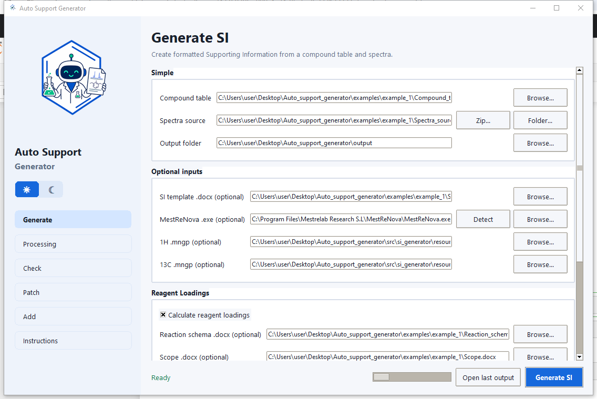

# Auto Support Generator

[English](README_EN.md) | **Русский**

## Research status and citation

Auto Support Generator is an early research software project for automated generation of supporting information in organic chemistry.

A ChemRxiv preprint describing the method, software architecture, and example workflows is currently in preparation.

Auto Support Generator — исследовательский проект с открытым исходным кодом. Исходный код проекта опубликован на GitHub.

Author: Danila Lebedev  
Copyright © 2026 Danila Lebedev

## Контакты

Если у вас есть вопросы, предложения или сообщения об ошибках, напишите автору:

- Email: [lebedevdanilaaa@gmail.com](mailto:lebedevdanilaaa@gmail.com)
- Telegram: [@lebdanchem](https://t.me/lebdanchem)

## License

Copyright © 2026 Danila Lebedev.

This project is licensed under the Apache License, Version 2.0.

See the [LICENSE](LICENSE) file for details.



## Назначение

Auto Support Generator автоматически собирает Supporting Information (SI) для органической химии. Программа переносит структуры ChemDraw, физические свойства и аналитические данные в Word, обрабатывает спектры ЯМР в MestReNova, рассчитывает загрузки и формирует отчеты проверки.

## Возможности

| Раздел | Что делает |
|---|---|
| **Generate** | Создает новый SI из таблицы соединений и raw-спектров; применяет профиль выбранного журнала. |
| **Processing** | Настраивает обработку ЯМР, вид appendix и проверку данных. |
| **Check** | Проверяет целостность ранее созданного output: manifest, DOCX, закладки и артефакты. |
| **Patch** | Создает измененную копию SI без повторной обработки спектров: renumber, remove, reorder, swap или переоформление под другой журнал. |
| **Add** | Добавляет новые соединения в существующий SI, не пересобирая старые блоки. |
| **Instructions** | Содержит встроенную справку, таблицу алиасов и скачиваемые примеры. |

Программа также:

- сохраняет структуры как редактируемые OLE-объекты ChemDraw;
- получает номенклатурные названия из ChemDraw;
- извлекает описания 1H/13C NMR и экспортирует PNG или кликабельные Mnova-объекты;
- рассчитывает HRMS и элементный анализ по формуле структуры;
- проверяет количество H/C в NMR, HRMS и элементный анализ;
- рассчитывает массы, количества, объемы, эквиваленты и выходы реакции;
- сохраняет обработанные `.mnova`, изображения, manifest, отчеты и логи.

## Требования

| Программа | Для чего нужна | Проверенная версия |
|---|---|---|
| Windows 10/11 | запуск приложения | 64-bit |
| Microsoft Word desktop | создание DOCX и OLE | Microsoft 365 / Word 2021 |
| ChemDraw | структуры и названия | 22.2.0.3300 |
| MestReNova | обработка ЯМР | 14.2.0-26256 |

Лицензионные установщики доступны через [официальную инструкцию ChemDraw](https://support.revvitysignals.com/hc/en-us/articles/4408210538132-How-do-I-download-the-MSI-installer-for-ChemDraw) и [официальную страницу загрузки Mnova](https://mestrelab.com/download). ChemDraw и MestReNova не входят в установщик Auto Support Generator и требуют собственных действующих лицензий.

В готовой сборке Python устанавливать не нужно. Перед первым запуском один раз откройте Word, ChemDraw и MestReNova вручную и завершите их первичную настройку. Если MestReNova не найдена автоматически, укажите ее `.exe` в Generate.

## Установка

1. Откройте папку `installer` в репозитории.
2. Скачайте и запустите `AutoSupportGeneratorSetup.exe`.
3. Разрешите установку только из доверенной копии этого репозитория.
4. Запустите **Auto Support Generator** с ярлыка.

Для запуска из исходного кода используйте Python 3.12, затем выполните `Setup Auto SI Generator.bat` и `Run Auto SI Generator.bat`.

## Быстрый старт

1. Откройте **Instructions → Example files → Copy all examples**.
2. Возьмите `example_1`: можно редактировать отдельные Word-файлы или один `All_in_one_input.docx`.
3. В **Generate** выберите журнал и режим **Separate files** либо **Single all-in-one DOCX**.
4. Укажите `Spectra_source` и папку результата. При необходимости измените `.mngp` и Processing.
5. В **Processing** проверьте настройки спектров.
6. Вернитесь в Generate и нажмите **Generate SI**.
7. После завершения нажмите **Open support** или **Open output folder**.

## Поля Generate

### Основные

| Поле программы | Что загрузить |
|---|---|
| **Publication preset** | Целевой журнал. Выбор применяет встроенный Word-шаблон, MNGP, диапазоны ppm и правила appendix; **Apply** возвращает значения профиля после ручных изменений. |
| **Input format** | **Separate files** для обычного набора документов или **Single all-in-one DOCX** для единого файла. |
| **Compound table** | `Compound_table.docx`: одна строка на соединение, номер, свойства, HRMS/IR/Anal и OLE-структура ChemDraw. |
| **All-in-one input** | `All_in_one_input.docx`, содержащий Compound table и необязательные секции Reaction schema, Scope и SI template. Используется только в режиме **Single all-in-one DOCX**. |
| **Spectra source** | Папку `Spectra_source` или `Spectra_source.zip` с подпапками по номерам соединений. |
| **Output folder** | Папку, внутри которой программа создаст отдельный каталог текущего запуска. |

### Optional inputs

| Поле программы | Что загрузить |
|---|---|
| **SI template .docx** | `SI_template.docx` с текстом, форматированием и алиасами. |
| **MestReNova .exe** | Путь к `MestReNova.exe`, если автоматический поиск не сработал. |
| **1H .mngp** | Пользовательский стиль отображения 1H NMR. Без файла используется встроенный classic. |
| **13C .mngp** | Пользовательский стиль отображения 13C NMR. Без файла используется встроенный classic. |

### Reagent Loadings

| Поле программы | Что загрузить |
|---|---|
| **Reaction schema .docx** | `Reaction_schema.docx`: список `Reagent_1`, `Reagent_2`, именованных реагентов и растворителей, их eq, MW, плотности или концентрации. |
| **Scope .docx** | `Scope.docx`: данные для каждого продукта, включая массы и структуры переменных реагентов. |

Включите расчет загрузок только при наличии обоих файлов. Номера продуктов в Compound table и Scope должны совпадать.

### Единый All-in-one DOCX

Файл разделяется неизменяемыми метками:

- `[AUTO SI: COMPOUND TABLE]` — обязательная таблица соединений;
- `[AUTO SI: REACTION SCHEMA]` — необязательные правила расчета реагентов;
- `[AUTO SI: SCOPE]` — необязательные данные серии;
- `[AUTO SI: SI TEMPLATE]` — необязательный текст и форматирование результата;
- `[AUTO SI: END]` — конец входных данных.

Если обе секции Reaction schema и Scope присутствуют, расчет загрузок включается автоматически. Если отсутствует SI template, используется выбранный **Publication preset**. Настройки Publication preset, Spectra source, MestReNova, `.mngp` и Processing задаются в приложении и не хранятся в all-in-one DOCX. Отсутствующие необязательные секции и поля не останавливают генерацию. Готовые объединенные примеры находятся в `examples/example_1/All_in_one_input.docx`, `example_2` и `example_3`.

## Processing

| Настройка | Значение |
|---|---|
| **Check support** | Проверять NMR, HRMS и элементный анализ во время генерации. |
| **Calculate elemental analysis** | Рассчитать Anal. по формуле, если поле не отключено знаком `-`. |
| **Spectra appendix** | `png` — картинки; `mnova` — кликабельные объекты; `none` — не добавлять appendix. |
| **1H/13C threshold** | Минимальная относительная высота пика. Увеличьте значение, если выбираются шум и примеси. |
| **Signal height** | Доля высоты страницы, занимаемая самым высоким сигналом. |
| **1H/13C ppm range** | Диапазон оси X на экспортируемой картинке. |
| **Highlight solvent peaks** | Показывать или скрывать определенные MestReNova пики растворителя. |
| **Baseline mode** | `auto`, `off`, `Bernstein` или `Whittaker`. |
| **Apply to 1H/13C** | Выбрать, для каких ядер выполнять baseline correction. |
| **Whittaker / polynomial parameters** | Экспертные параметры соответствующего алгоритма baseline. |

При проверке `13C NMR` программа автоматически читает структуру ChemDraw и считает симметрически эквивалентные ароматические углероды одним ожидаемым сигналом. Неароматические углероды остаются отдельными. Если структура или SMILES недоступны либо не согласуются с формулой, применяется строгая проверка по общему числу атомов C.

## Формат Spectra source

```text
Spectra_source/
  2a/
    experiment_1H/fid
    experiment_13C/fid
  2b/
    experiment_1H/fid
    experiment_13C/fid
```

Названия внутренних экспериментов произвольны: тип ядра определяется по acquisition metadata. Набор номеров верхнего уровня должен совпадать с Compound table.

## Check

1. Загрузите `support_information.manifest.json` из `docx` старого запуска.
2. При необходимости укажите перемещенный `support_information.docx`.
3. Нажмите **Check support**.

Check проверяет manifest, порядок соединений, существование DOCX/артефактов, закладки и неразрешенные алиасы. Он не запускает MestReNova и не пересчитывает химические данные; аналитическая проверка выполняется в Generate.

## Patch

Выберите **Existing output folder**, одну операцию и нажмите **Apply patch**. Исходный SI не изменяется, результат сохраняется в новой папке.

| Операция | Формат | Результат |
|---|---|---|
| **Renumber** | `2a=3a,2b=3b` | Меняет номера соединений и связанные ссылки. |
| **Remove** | `2a,2c` | Удаляет выбранные соединения и их appendix. |
| **Reorder** | Полный список, например `2c,2a,2b` | Меняет порядок блоков; нужно указать все номера. |
| **Swap compounds** | `2a=3a` | Меняет местами полные назначения соединений, сохраняя видимый порядок номеров. |
| **Reformat existing SI** | Выбрать целевой Publication preset | Пересобирает оформление из manifest, повторно используя готовые данные, спектры и ChemDraw OLE. |

Patch использует уже обработанные PNG и Mnova OLE и не запускает новую обработку спектров. Каждая операция создает новый run и не изменяет исходный SI.

## Add

1. Выберите **Previous output folder**: manifest и старый DOCX подставятся автоматически.
2. Загрузите Compound table и Spectra source только для новых соединений.
3. Выберите режим и нажмите **Add compounds**.

| Режим | Поведение |
|---|---|
| **Same series** | Повторно использует старые publication preset, template, Reaction schema и Processing settings. Новый Scope загружается отдельно. |
| **New method** | Позволяет выбрать новый publication preset и задать новые SI template, Reaction schema и Scope; настройки можно уточнить в Processing. |

Старые блоки не пересобираются. Дублирующийся номер или несовпадающие номера во входных файлах останавливают операцию с понятным сообщением.

## Профили журналов

В Generate доступен **Publication preset**. Сначала выберите журнал и нажмите **Apply**, затем при необходимости измените отдельные параметры в Processing. Профиль задает встроенный Word-шаблон, поля и шрифт документа, диапазоны спектров, MNGP по умолчанию, ориентацию appendix и дополнительные предупреждения проверки. Настройки Processing, измененные после применения профиля, считаются пользовательскими переопределениями и сохраняются в manifest. В Patch операция **Reformat existing SI** применяет другой профиль к уже созданному SI без повторного запуска обработки Mnova.

| Издательство | Доступные профили |
|---|---|
| **ACS** | The Journal of Organic Chemistry (JOC), Organic Letters (Org. Lett.), Journal of Medicinal Chemistry, JACS |
| **RSC** | Organic Chemistry |
| **Wiley** | Angewandte Chemie, Chemistry Europe / EurJOC, Archiv der Pharmazie |
| **Elsevier** | Tetrahedron, Tetrahedron Letters, European Journal of Medicinal Chemistry, Bioorganic & Medicinal Chemistry |
| **Nature Portfolio** | Nature Chemistry, Communications Chemistry |
| **Другие** | Molecules, Beilstein Journal of Organic Chemistry, Chemical Papers, General Organic SI |

Профили построены как общее правило издательства плюс уточнение конкретного журнала. Встроенные DOCX являются воспроизводимыми шаблонами программы на основе действующих author guidelines, а не официальными файлами издательств. Перед подачей сверяйтесь с сайтом журнала. Источники и дата проверки сохраняются в `support_information.manifest.json`; подробная матрица находится в [`docs/journal_si_template_requirements.md`](docs/journal_si_template_requirements.md).

## SI template и алиасы

Шаблон выглядит как будущий SI. Введите алиас в фигурных скобках и оформите его в Word жирным/курсивом: вставленное значение наследует это оформление.

Основные группы:

- `Product.*`: `{Product.name}`, `{Product.number}`, `{Product.structure}`, `{Product.mg}`, `{Product.mmol}`, `{Product.yield.percent}`, `{Product.appearance}`, `{Product.mp}`, `{Product.rf.value}`, `{Product.rf.system}`, `{Product.nmr.1h.picture}`, `{Product.nmr.13c.picture}`.
- `Reagent_N.*`: `.name`, `.mg`, `.g`, `.kg`, `.mmol`, `.mol`, `.mcl`, `.ml`, `.l`, `.eq`, `.number`.
- Именованные реагенты и растворители используют те же атрибуты: `{NBS.mg}`, `{AcOH.mcl}`, `{Solvent_MeCN.ml}`.
- NMR: `{nmr.1h.label}`, `{nmr.1h.conditions}`, `{nmr.1h.peaks}`, аналогично `nmr.13c`, плюс `{nmr.extra}`.
- HRMS: `{hrms.label}`, `{hrms.adduct}`, `{hrms.formula}`, `{hrms.calculated}`, `{hrms.found}`.
- Anal: `{anal.label}`, `{anal.formula}`, `{anal.calculated}`, `{anal.found}`.
- IR: `{ir.label}`, `{ir.method}`, `{ir.peaks}`.

Полная таблица с пояснением каждого алиаса находится в **Instructions → Template aliases**.

## Примеры

В репозитории и в **Instructions → Example files** находятся только три согласованных набора:

| Папка | Содержание |
|---|---|
| [`examples/example_1`](examples/example_1) | Первая серия, соединения 2a–2d; Spectra source как папка. |
| [`examples/example_2`](examples/example_2) | Продолжение серии, соединения 2e–2f. |
| [`examples/example_3`](examples/example_3) | Новая методика, соединения 3a, 3b, 3c, 3d, 3i; Spectra source как папка и zip. |

Во всех папках одинаковые имена, совпадающие с полями GUI: `Compound_table.docx`, `Spectra_source`, `SI_template.docx`, `Reaction_schema.docx`, `Scope.docx`.

## Результат

Каждый запуск создает `output/runs/YYYYMMDD_HHMMSS_имя/`:

| Папка | Содержимое |
|---|---|
| `docx/` | `support_information.docx`, `support_information.manifest.json` и `support_information.run_summary.json` |
| `input/` | копии Word-входов, профилей `.mngp` и использованного Spectra source |
| `spectra/` | каталог `processed_spectra/`, PNG и архив `processed_spectra.zip`, если спектры обрабатывались |
| `mnova/` | каталог `processed/` с обработанными и одиночными `.mnova` для кликабельных объектов |
| `logs/` | логи запуска, автоматизации Word/ChemDraw/Mnova и каталог `mnova_reports/` |
| `reports/` | текстовые отчеты NMR и отчеты проверки; операции Add/Patch также сохраняют собственный JSON-отчет |

При ошибке сначала откройте `logs/` последнего запуска. Не редактируйте выходной DOCX во время повторной генерации: Word блокирует открытый файл. Для сообщения об ошибке приложите `support_information.run_summary.json` и папку `logs/` проблемного запуска.
