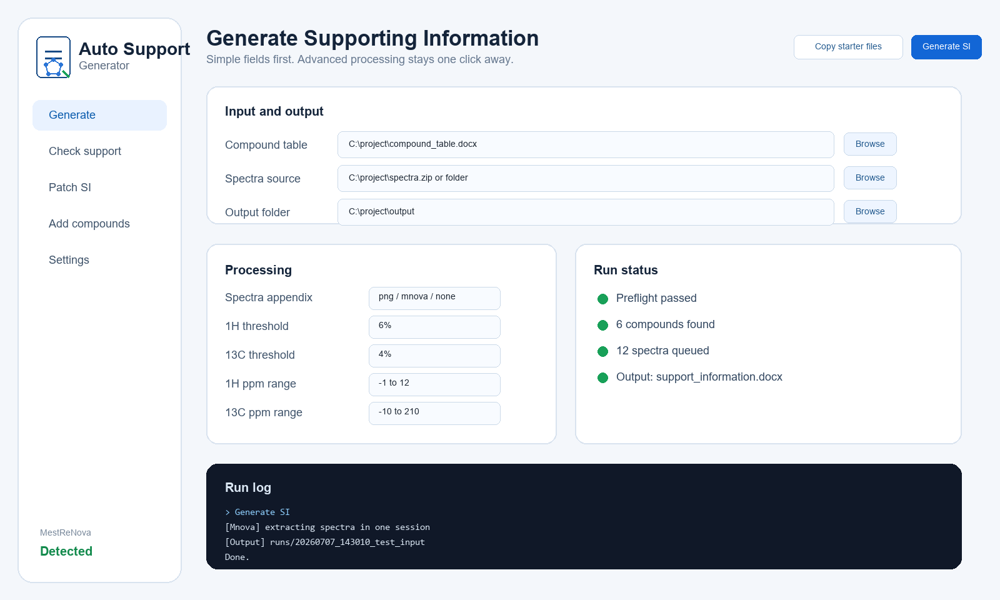
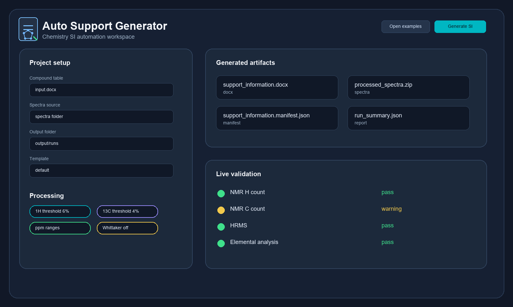
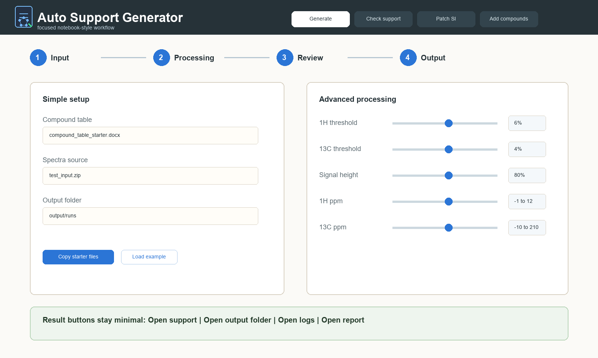
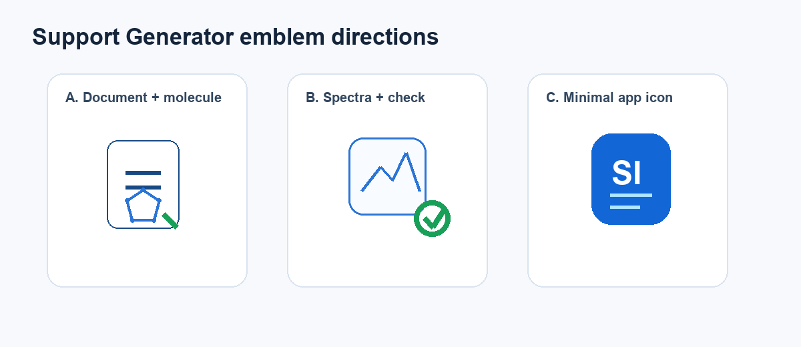

# GUI design options

These mockups show possible directions for a more product-like Auto Support
Generator interface. They are not implemented yet; they are design references
for the next GUI iteration.

## Option A: Fluent light workspace

Best fit if the app should feel like a modern Windows productivity tool.
Implementation options: keep Tkinter and heavily style `ttk`, or move later to
a richer desktop UI framework.

## Option B: CustomTkinter dark workspace

Best fit if we want a contemporary dark-mode application with clear cards,
artifact status and validation status.

## Option C: ttkbootstrap notebook workflow

Best fit if we want the lowest-risk migration from the current Tkinter GUI:
same mental model, cleaner theme, clearer step flow.

## Emblem directions

Recommended starting point: option A, `Document + molecule`. It communicates SI
generation and chemistry better than a generic `SI` app icon.

## References

- ttkbootstrap themes: https://ttkbootstrap.readthedocs.io/en/latest/themes/
- CustomTkinter overview: https://customtkinter.tomschimansky.com/
- CustomTkinter appearance mode: https://customtkinter.tomschimansky.com/documentation/appearancemode/
- Microsoft Fluent 2: https://fluent2.microsoft.design/
